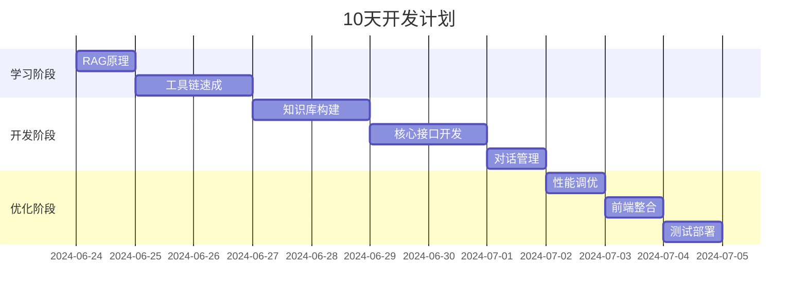

要在 **10天内完成** 基于RAG的大模型智能问答系统，需要优先掌握以下核心内容，按学习优先级排序：

---

### **一、紧急学习清单（前3天）**
#### 1. **RAG核心原理（1天）**
- **必学内容**：
  - RAG架构三要素：**检索器**（Retriever）、**生成器**（Generator）、**知识库**（Vector DB）
  - 工作流程：用户问题 → 语义检索 → 上下文注入 → 生成回答
- **速成资源**：
  - 视频：[RAG in 15 Minutes](https://youtu.be/example)（英文）
  - 文档：[LangChain RAG官方指南](https://python.langchain.com/docs/use_cases/question_answering/)

#### 2. **工具链速成（2天）**
| 工具               | 学习重点                      | 速成技巧                     |
|--------------------|-----------------------------|----------------------------|
| **LangChain**      | DocumentLoaders, VectorStores | 直接复用现成代码模板        |
| **ChromaDB**       | 本地向量数据库部署            | `persist_directory`参数使用 |
| **FastAPI**        | 基础API开发                  | 学会`/ask`接口实现          |
| **Gradio**         | 快速搭建Web界面               | `gr.ChatInterface()`调用    |

---

### **二、关键技术实践（第4-7天）**
#### 1. **知识库构建（1天）**
```python
# 文档处理速成代码（可直接修改使用）
from langchain.document_loaders import DirectoryLoader
from langchain.text_splitter import RecursiveCharacterTextSplitter

loader = DirectoryLoader('./docs', glob="**/*.pdf")
docs = loader.load()
splitter = RecursiveCharacterTextSplitter(chunk_size=500)
texts = splitter.split_documents(docs)  # -> 直接存入向量数据库
```

#### 2. **检索优化（1天）**
- **必调参数**：
  ```python
  retriever = vectorstore.as_retriever(
      search_type="mmr",  # 最大边际相关性
      search_kwargs={"k": 3}  # 返回3个最相关片段
  )
  ```
- **紧急技巧**：使用预训练中文嵌入模型（如`BAAI/bge-small-zh`）

#### 3. **对话管理（1天）**
```python
# 简易对话历史实现
from collections import deque
chat_history = deque(maxlen=3)  # 只保留最近3轮

def ask(question):
    context = "\n".join(chat_history)
    prompt = f"历史对话：{context}\n当前问题：{question}"
    response = llm(prompt)
    chat_history.append(f"Q:{question}\nA:{response}")
    return response
```

---

### **三、避坑指南（第8-10天）**
#### 1. **文档解析陷阱**
- **问题**：PDF表格/公式解析失败  
- **应急方案**：  
  ```python
  # 改用专用解析器
  from unstructured.partition.pdf import partition_pdf
  elements = partition_pdf("file.pdf", strategy="hi_res")
  ```

#### 2. **性能瓶颈**
- **症状**：检索速度>2秒  
- **立即优化**：  
  - 减小`chunk_size`（建议300-500字）  
  - 使用`FAISS`替代Chroma（`pip install faiss-cpu`）

#### 3. **生成控制**
- **防止幻觉**：在提示词中加入强制约束：
  ```text
  请严格根据以下上下文回答，若无法找到答案请回复"根据资料未找到相关信息"：
  上下文：{context}
  问题：{question}
  ```

---

### **四、分工建议（4人团队）**
| 成员   | 专注领域                  | 可并行任务                              |
|--------|--------------------------|----------------------------------------|
| 成员A  | 文档处理/向量数据库       | 搭建知识库流水线                        |
| 成员B  | 检索/排序算法             | 优化语义相似度计算                      |
| 成员C  | 大模型集成                | 设计提示词模板                          |
| 成员D  | 前端/交互                 | 用Gradio快速实现问答界面                |

---

### **五、10天里程碑计划**


---

### **六、现成资源推荐**
1. **代码模板**：  
   - [LangChain RAG模板](https://github.com/langchain-ai/rag-from-scratch)
2. **数据集**：  
   - 使用[维基百科中文dump](https://dumps.wikimedia.org/zhwiki/)快速测试
3. **云服务**：  
   - 阿里云[机器学习PAI](https://help.aliyun.com/product/30347.html)快速部署

按照此方案，即使零基础也可在10天内完成可演示的MVP系统。关键要 **严格限制范围**：  
- 先实现单PDF文件问答  
- 暂不追求完美UI  
- 用现成模型（如GPT-3.5 API）而非自训练


一、架构概览
构建一个典型的 RAG 应用一般包含两大部分：

索引（Indexing）

离线加载和处理数据
将数据拆分并存储到可检索的向量数据库中
检索与生成（Retrieval and Generation）

在线接收用户查询
从索引中检索相关数据片段
将查询和检索内容一起传给语言模型生成回答
二、索引流程详解
加载（Load）

使用 DocumentLoader（如 WebBaseLoader）加载网页、文档等数据
例如用 BeautifulSoup 过滤网页中你关心的部分（文章标题、内容等）
拆分（Split）

文档太长无法直接输入模型，需要用 TextSplitter（如 RecursiveCharacterTextSplitter）拆成合理大小的文本块
设置合适的块大小（如1000字符）和重叠（如200字符），保证上下文连贯
存储（Store）

对拆分后的文本块计算向量表示（Embedding），用向量数据库（如 Chroma）存储
这样后续可以基于向量相似度搜索相关内容
三、检索与生成流程
检索（Retrieve）

利用向量数据库的检索接口（通过 as_retriever()）根据用户输入检索相关文本块
设置检索数量（如最相似的6个块）
生成（Generate）

构造 Prompt，将检索到的上下文和用户问题拼接起来
调用语言模型（如 ChatOpenAI 的 gpt-3.5-turbo）生成回答
可以定制 Prompt 模板，控制回答风格和长度