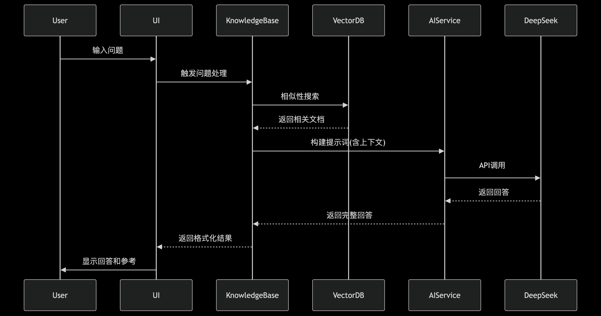
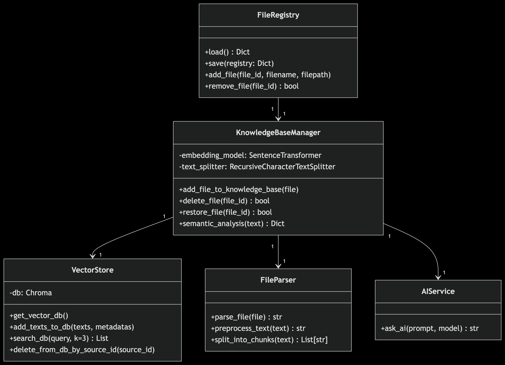

# 智能文献问答系统设计说明书

## 1. 系统体系架构

**三层架构设计**：
- **表示层**：Streamlit Web界面
- **业务逻辑层**：
  - 文件解析模块(file_parser)
  - 知识库管理模块(knowledge_base_manager)
  - AI服务模块(ai_service)
  - 向量数据库模块(vector_store)
- **数据层**：
  - ChromaDB向量数据库
  - 文件注册表(JSON)
  - 本地文件存储

[架构图]
```
表示层 → 业务逻辑层 → 数据层
           ↑
        AI服务层(DeepSeek)
```

## 2. 系统功能结构

**核心功能模块**：
1. 文件管理
   - 多格式文件解析(PDF/DOCX/PPTX/TXT)
   - 文件持久化存储
   - 文件标记与回收站

2. 知识库管理
   - 文本分块处理
   - 向量化存储
   - 语义检索

3. 智能问答
   - 上下文理解
   - 多风格回答
   - 文献引用

4. 系统管理
   - 会话管理
   - 数据清理
   - 系统监控

## 3. 系统用例时序图

**文件上传处理时序**：
```
用户 → 界面层: 上传文件
界面层 → 文件解析器: 调用parse_file()
文件解析器 → 临时存储: 创建临时文件
文件解析器 → 格式处理器: 按类型解析
格式处理器 → 文本处理器: 返回纯文本
文件解析器 → 知识库管理器: 返回解析结果
知识库管理器 → 向量数据库: 存储文本块
向量数据库 → 知识库管理器: 确认存储
知识库管理器 → 界面层: 显示上传结果
```

**问答处理时序**：
```
用户 → 界面层: 输入问题
界面层 → 知识库管理器: 触发semantic_analysis()
知识库管理器 → 向量数据库: similarity_search()
向量数据库 → 知识库管理器: 返回相关文档
知识库管理器 → AI服务: 构建prompt并调用ask_ai()
AI服务 → DeepSeek API: 发送请求
DeepSeek API → AI服务: 返回回答
AI服务 → 界面层: 格式化响应
界面层 → 用户: 显示回答和参考文献
```
**时序图**：


## 4. 复杂功能算法设计

**文本分块算法**：
```python
procedure split_text(text, chunk_size=1000, overlap=200)
    if text is empty then
        return empty list
    end if
    
    words = tokenize(text)
    chunks = []
    start = 0
    
    while start < length(words) do
        end = min(start + chunk_size, length(words))
        chunk = join(words[start:end])
        append chunk to chunks
        start = end - overlap
    end while
    
    return chunks
end procedure
```

**语义分析算法流程**：
1. 输入用户问题
2. 意图识别(关键词匹配)
3. 实体提取(正则表达式)
4. 生成嵌入向量(Sentence Transformer)
5. 输出分析结果

## 5. 面向对象类图设计

**核心类**：
```
class FileRegistry
  +load(): dict
  +save(registry)
  +add_file(id, name, path)
  +remove_file(id)

class KnowledgeBaseManager
  -embedding_model
  -text_splitter
  +add_file_to_knowledge(file)
  +delete_file(id)
  +semantic_analysis(text)

class VectorStore
  -db: ChromaDB
  +add_texts(texts, metadatas)
  +search(query, k=3)
  +delete_by_source(id)

class AIService
  +ask_ai(prompt)
```

**关系**：
- KnowledgeBaseManager 聚合 VectorStore
- KnowledgeBaseManager 使用 FileRegistry
- AIService 独立服务. 

## 6. 接口设计

**外部接口**：
- DeepSeek API：
  - 端点：api.gpt.ge/v1/
  - 认证：API Key
  - 请求格式：JSON
  ```json
  {
    "model": "deepseek-chat",
    "messages": [
      {"role": "system", "content": "..."},
      {"role": "user", "content": "..."}
    ]
  }
  ```

**内部接口**：
1. 文件解析接口：
   - 输入：文件对象
   - 输出：解析后的纯文本

2. 向量存储接口：
   - add_texts(texts, metadatas)
   - search(query, k=3)

3. AI服务接口：
   - ask_ai(prompt) -> str

## 7. 数据库物理设计

**ChromaDB集合结构**：
- 文档表(documents):
  - id: 主键
  - embedding: 向量
  - metadata: {
    "source": 文件名,
    "source_id": 文件哈希,
    "type": 文件类型,
    "upload_time": ISO时间
  }
  - content: 文本内容

**文件注册表(JSON)**：
```json
{
  "file_id": {
    "filename": "example.pdf",
    "filepath": "/path/to/file",
    "timestamp": "2024-03-20T12:00:00"
  }
}
```

## 8. UI设计

**界面布局**：
1. 导航菜单（左侧边栏）
   - 知识库管理/智能问答切换
   - 系统概览面板
   - 清空数据按钮

2. 知识库管理页：
   - 文件上传区
   - 文件列表表格
   - 文件操作面板（标记/删除）
   - 回收站管理

3. 智能问答页：
   - 聊天历史展示区
   - 风格选择器
   - 问题输入框
   - 参考文献展开面板

**交互流程**：
1. 文件上传 → 自动解析 → 显示在表格
2. 提问 → 显示回答 → 可查看参考文献
3. 删除文件 → 移至回收站 → 可恢复

**响应式设计**：
- 适配不同屏幕尺寸
- 操作按钮状态反馈
- 加载状态指示器


